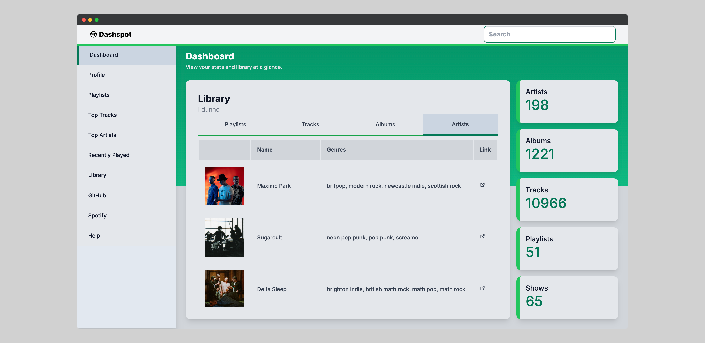

# Spotify Dashboard

[](https://app.netlify.com/sites/dashspot-dev/deploys)

DashSpot is a dynamic visualizing dashboard designed to explore and analyze
Spotify libraries meant to be like an itunes style library browser.

It is built with Django, Postgres, Celery, and React on top of the Spotify API.

By adding additional integration with Wikipedia and MusicBrainz, DashSpot builds
a comprehensive database of music metadata relevant to them.



Check out the [docs](https://dashspot-dev.netlify.app/)!

## Setup

Copy the sample `.env` file and fill in the necessary environment variables. I
use bitwarden to manage my secrets.

```bash
cp .env.sample .env
```

### Virtual Environment

```bash
asdf install # Optional, relies on .tool-versions
```

```bash
pip install poetry
poetry env use python 3.12
source $(poetry env info --path)/bin/activate
poetry install
```

### Database

The settings module relies on a database environment variable. How you set this
up is up to you. I use a shared docker container for postgres databases on my
local machines. What's important is that the server is running and the database
is created, with up to date credentials in the `.env` file.

```bash
./manage.py migrate
```

### Running the application

1. Make sure you set the Spotify API credentials in the `.env` file, and setup
    the Spotify API callback URL in the Spotify Developer Dashboard.
2. `./manage.py runserver` to start the Django server (don't forget to apply
   migrations before you start the server)
3. `celery -A server worker -l INFO`

Alternatively, you can use the `Makefile` to run the application (see `make help`).
Running the workers through the `Makefile` has hot-reloading with watchdog (`watchmedo`).

```bash
make server
make worker
make flower # Optional, for monitoring the workers
```

## Spotify API

The core integration is built with Spotify.

### Attribution

From the [top tracks](https://developer.spotify.com/documentation/web-api/reference/#endpoint-get-users-top-artists-and-tracks) endpoint documentation:

> Please keep in mind that metadata, cover art and artist images must be
> accompanied by a link back to the applicable artist, album, track, or playlist
> on the Spotify Service.
>
> You must also attribute content from Spotify with the logo.
