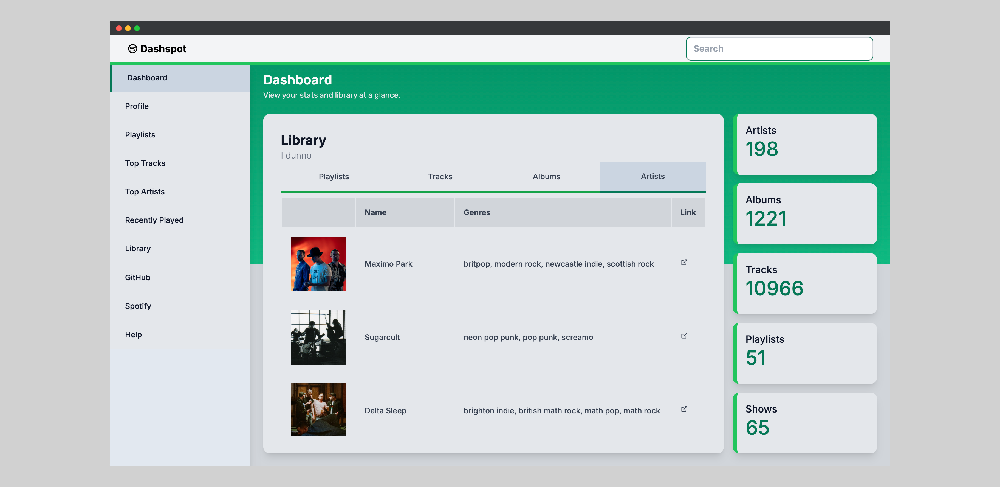

# Spotify Dashboard

DashSpot is a dynamic visualizing dashboard designed to explore and analyze
Spotify libraries meant to be like an itunes style library browser.

It is built with Django, Postgres, Celery, and React on top of the Spotify API.

By adding additional integration with Wikipedia and MusicBrainz, DashSpot builds
a comprehensive database of music metadata relevant to them.



## Setup

Copy the sample `.env` file and fill in the necessary environment variables. I
use bitwarden to manage my secrets.

```bash
cp .env.sample .env
```

## Back-end

This is a Django application that uses REST framework for serializing and
deserializing objects.

## Front-end

This dashboard is built using React & Tailwind.

## Documentation

### Design

#### Colors

The colors are inspired by the Spotify brand colors and come from the base
colors in the Tailwind CSS framework.

Primary: Emerald 600
Secondary: Sky 500
Text: Zinc 800
Background: Neutral 200

### Authentication

**Sign-up**: Client side route at `/signup`

- The sign-up button sends an empty `POST` request to the server at `/api/signup/`
    - The server redirects the user to the Spotify Authorization page.
    - The user logs in to spotify and authorizes the application.
        - In local development, the redirect uri is `http://localhost:8000/api/spotify_cb`
    - With the authorization code, the server requests an access token from Spotify.
    - Then the server creates a new user with the access token and refresh token,
    and the user's spotify id and email address.

**Login**: Client side route at `/login`

- The login button sends an empty `PUT` request to the server at `/api/login/`
- Upon receiving the authorization code, the server requests an access token
from Spotify and fetches the user's information from the API. It users the
user's spotify id and email address to find the user in the database.
- After the user logs in, the user is redirected to the dashboard with a JWT token.
    - Client side route at `/dashboard?token=<JWT_TOKEN>`
    - The JWT token is stored in the browser's local storage.
    - The token is used to authenticate the user for all requests to the server
    with `simple-jwt`.

## Spotify API

### Example - Current User (`/me`)

```json
{
  "country": "string",
  "display_name": "string",
  "email": "string",
  "explicit_content": {
    "filter_enabled": false,
    "filter_locked": false
  },
  "external_urls": {
    "spotify": "string"
  },
  "followers": {
    "href": "string",
    "total": 0
  },
  "href": "string",
  "id": "string",
  "images": [
    {
      "url": "https://i.scdn.co/image/ab67616d00001e02ff9ca10b55ce82ae553c8228",
      "height": 300,
      "width": 300
    }
  ],
  "product": "string",
  "type": "string",
  "uri": "string"
}
```

### Attribution

From the [top tracks](https://developer.spotify.com/documentation/web-api/reference/#endpoint-get-users-top-artists-and-tracks) endpoint documentation:

> Please keep in mind that metadata, cover art and artist images must be
> accompanied by a link back to the applicable artist, album, track, or playlist
> on the Spotify Service.
>
> You must also attribute content from Spotify with the logo.
