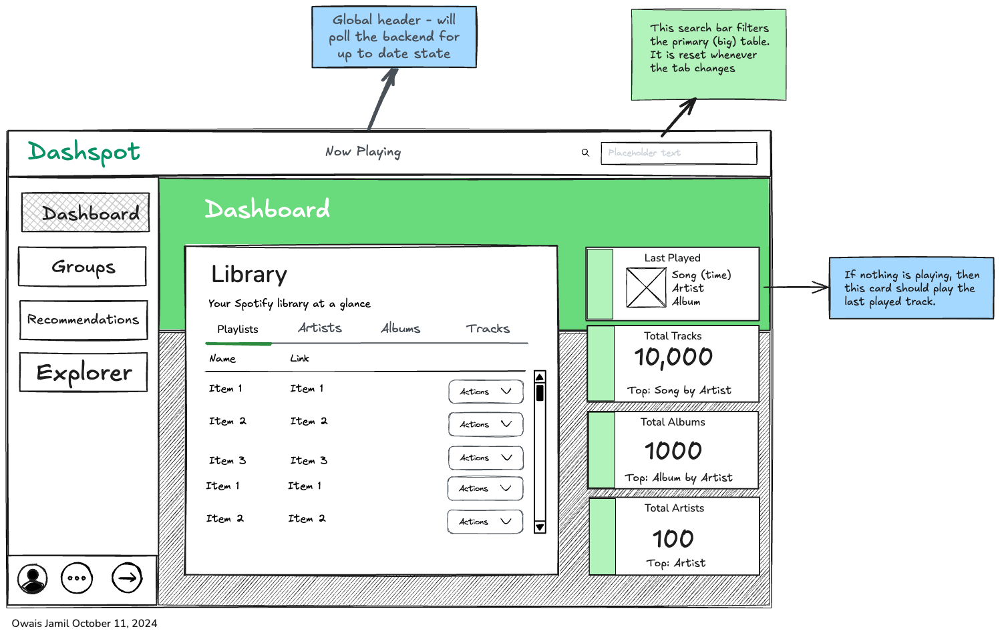

# Front-end Web

## Nginx & Vite

Nginx is used to proxy requests to the Vite development server. This allows us to
use the same path for the client and server, and to use HTTPS locally. In order
to do this, the vite config has to direct the assets to a different path than the
root. I opted for `/hmr` so nginx doesn't ping the server repeatedly and cause
the browser to reload ad infinitum.

## Styling

Styling is inspired by a number of sources, namely Tailwind UI, Flowbite, and
Shadcn components. However, all business logic for components are hand-rolled.
TailwindCSS is used for the components.

### Color Palette


```yaml
- tailwind: 'green-500'
    hex: '#10B981'
- tailwind: 'emerald-500'
    hex: '#22C55E'
- tailwind: 'zinc-50'
    hex: '#FAFAFA'
- tailwind: 'rose-500'
    hex: '#F43F5E'
```

### Fonts

The main body/sans font is `Inter`. Headings are in flux, between `DM Sans`,
`Karla`, or just `Inter` with a different weight and letter spacing.

### Icons

Icons come primarily from [Remix Icon](https://remixicon.com/), with a few from
[Devicon](https://devicon.dev/), and [Openmoji](https://openmoji.org/).

Remix was selected because of the breadth of icons available, and the two variants
for each icon (outline and filled).

### Application Design

Home page (as of October 12):


...versus the original concept:



## React Specific

### Routing

Wouter

### State Management

Zustand is used to manage global state in the application, as well as managing
data for some contexts. The token is persisted in `localStorage` and is called by
the `useTokenStore` hook that is leveraged by the queries across the application.

### API Requests

React Query on top of the browser `fetch` API.

### Component Implementations

Eventually I'd like to add a storybook to this project, but for now I'm just
going to explain some of the wiring for the components.

Component prop types are either inline or defined with interfaces in the same
module.

### Drawers

State machine managed by zustand, that is local to the main dashboard/layout.
A similar strategy will be used for modals & confirm dialogs.

### Data Display

1. Tables
2. Description Lists
3. Cards
4. Charts - represented with Chart.js.

### Filtering Data

Filter state (in forms) was initially managed by Zustand, but I've since moved it to the URL
so local form input state pushes to the URL/the URL sets the initial state of forms.
This applies to pagination as well.
